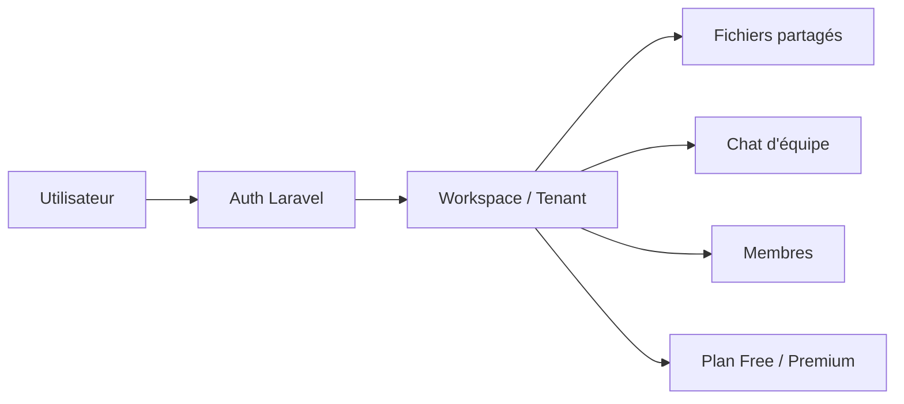

# SaaS-Share

**Plateforme SaaS multi-tenant** — espaces de travail isolés, partage de fichiers et chat d'équipe en temps réel.

[](https://laravel.com)
[](https://php.net)
[](https://tailwindcss.com)
[](LICENSE)

---

## Aperçu

SaaS-Share permet à chaque entreprise de disposer de son **propre espace de travail** (tenant) totalement isolé. Les utilisateurs peuvent :

- **Créer** un espace et inviter leur équipe via un code unique
- **Rejoindre** un espace existant avec ce code
- **Partager des fichiers** au sein de l'équipe
- **Communiquer** via un chat d'espace (rafraîchissement automatique)
- Gérer un modèle **Free / Premium** (limite d'upload simulée)

> Idéal pour démontrer une architecture SaaS complète : authentification, multi-tenant, dashboard, stockage et monétisation freemium.

---

## Fonctionnalités

| Module | Description |
|--------|-------------|
| **Multi-tenant** | Chaque workspace est isolé (fichiers, chat, membres) |
| **Inscription** | Créer une entreprise ou rejoindre une équipe par code |
| **Fichiers** | Upload, téléchargement, tri (nom, date, taille) |
| **Chat** | Messagerie d'équipe avec rafraîchissement auto (3 s) |
| **Plans** | Free : 3 fichiers/compte · Premium : upload illimité |
| **Paramètres** | Drawer latéral — pseudo, plan, membres, aide intégrée |

---

## Architecture



**Stack technique**

- **Backend** — Laravel 12, PHP 8.2
- **Frontend** — Blade + Tailwind CSS (CDN)
- **Base de données** — PostgreSQL (local via pgAdmin 4 + production Render)
- **Déploiement** — Docker + Render

---

## Démo en ligne

**[https://saas-share.onrender.com](https://saas-share.onrender.com)**

---

## Exemple de Scénario de démo 

| Étape | Persona | Action | Résultat attendu |
|-------|---------|--------|------------------|
| 1 | **Jean** | Crée l'espace `Alpha` → upload 1 fichier | Code généré (ex. `ALPHA1`) |
| 2 | **Lili** | Rejoint `ALPHA1` → télécharge + chat | Collaboration sur le même espace |
| 3 | **Sophie** | Crée l'espace `Beta` | Dashboard vide — isolation multi-tenant |
| 4 | **Jean** | 3 fichiers max (Free) → **Passer Premium** | Upload débloqué |

```
Jean   → Alpha (ALPHA1) → 1 fichier
Lili   → Rejoint ALPHA1 → chat + téléchargement
Sophie → Beta           → espace isolé
Jean   → 3 fichiers max → Premium → illimité
```

Voir aussi [`demo.txt`](demo.txt) pour le script complet.

---

## Installation locale

### Prérequis

- PHP 8.2+ avec extension `pdo_pgsql`
- Composer
- PostgreSQL
- [pgAdmin 4](https://www.pgadmin.org/) (gestion de la base en local)

### 1. Créer la base dans pgAdmin 4

1. Ouvrir **pgAdmin 4**
2. Se connecter au serveur PostgreSQL local
3. Clic droit sur **Databases** → **Create** → **Database…**
4. Nom : `saas_share` → **Save**

### 2. Configurer le projet

```bash
# Cloner le projet
git clone https://github.com/votre-user/saas-share.git
cd saas-share

# Dépendances
composer install

# Configuration
cp .env.example .env
php artisan key:generate
```

Dans `.env`, configurer PostgreSQL :

```env
DB_CONNECTION=pgsql
DB_HOST=127.0.0.1
DB_PORT=5432
DB_DATABASE=saas_share
DB_USERNAME=postgres
DB_PASSWORD=votre_mot_de_passe
```

### 3. Migrations et lancement

```bash
php artisan migrate
php artisan serve
```

Ouvrir [http://localhost:8000](http://localhost:8000)

---

## Déploiement Docker (Render)

Le projet inclut un `Dockerfile` prêt pour la production :

```bash
docker build -t saas-share .
docker run -p 80:80 \
  -e APP_KEY=base64:... \
  -e APP_ENV=production \
  -e DATABASE_URL=postgresql://... \
  saas-share
```

Au démarrage, le conteneur exécute automatiquement les migrations et met en cache la config.

**Variables d'environnement clés (Render)**

| Variable | Description |
|----------|-------------|
| `APP_KEY` | Clé Laravel (`php artisan key:generate --show`) |
| `APP_ENV` | `production` |
| `APP_URL` | URL publique de l'app |
| `DATABASE_URL` | Connexion PostgreSQL fournie par Render |

---

## Structure du projet

```
app/
├── Http/Controllers/
│   ├── Auth/          # Login, inscription (create / join workspace)
│   └── DashboardController.php
├── Models/
│   ├── User.php
│   ├── Workspace.php
│   ├── File.php
│   └── Message.php
resources/views/
├── auth/              # login, register
├── dashboard.blade.php
└── layouts/app.blade.php
database/migrations/   # users, workspaces, files, messages
```

---

## Routes principales

| Méthode | Route | Description |
|---------|-------|-------------|
| `GET` | `/register` | Inscription |
| `GET` | `/login` | Connexion |
| `GET` | `/dashboard` | Tableau de bord |
| `POST` | `/files` | Upload fichier |
| `GET` | `/files/{id}/download` | Téléchargement |
| `POST` | `/messages` | Envoyer un message |
| `POST` | `/workspace/upgrade` | Passer Premium |
| `POST` | `/profile/name` | Modifier le pseudo |

---

## Licence

Projet open source

---

<p align="center">
  Développé avec Laravel · SaaS-Share © 2026
</p>
